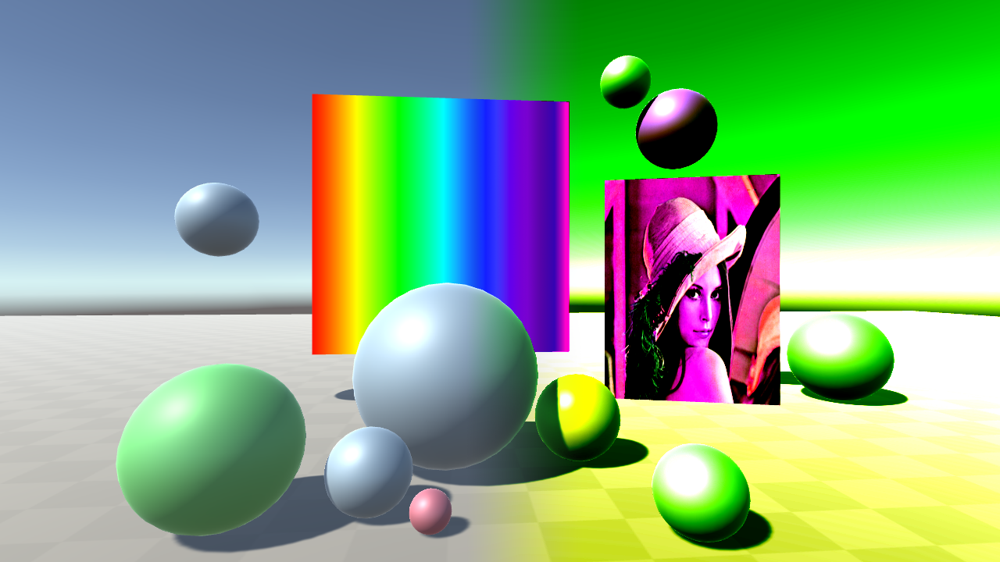
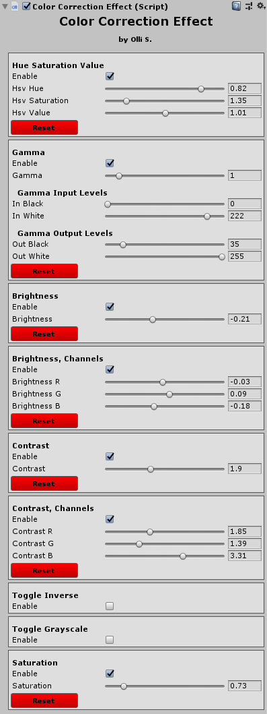

# ColorCorrectEffect

## What is it

I wrote this Unity Image Effect when Post-processing Stack v2 didn't exist yet. Image effects are full-screen postprocessing effects which alter the rendered camera image. They can be used to adjust the look of your game and generally for overall adjustments of the colors. But this does work just fine in Unity 2018.4 (for example) with the built-in Render Pipeline. I also made a custom Editor for this effect so that it's a bit more usable and has easier to read layout.

## Motivation

The idea for this was just to use this in a project of mine, and I wanted to have better color adjustment options.
Many of the image adjustments are relatively simple, but they were something I wanted to have in the same tool.

I will not probably convert this to HDRP custom-post processing, as there's nowadays better image color adjustment tools available in Unity.

## Features

### Adjustments

- Hue, Saturation and Value adjustment

- Gamma level adjustment

- Gamma input and output level adjustments
    - In black
    - In white
    - Out black
    - Out white
- Brightness

- Brightness per channel adjustment

- Contrast

- Contrast per channel adjustment

- Invert image

- Grayscale

- Saturation

### Other features

- Customized Inspector UI
    - Undo etc. work ok.

- Reset (to defaults) for each option

- Closing sub-sections

## Color Correction Effect UI

